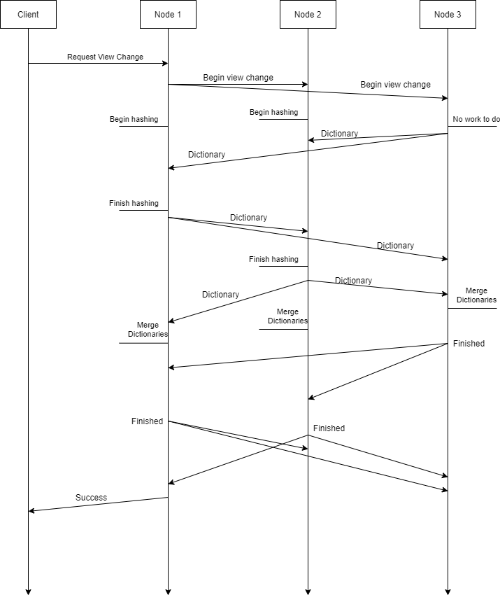
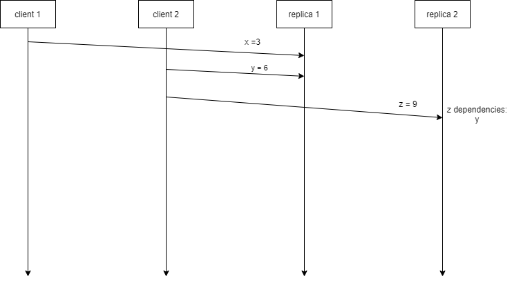
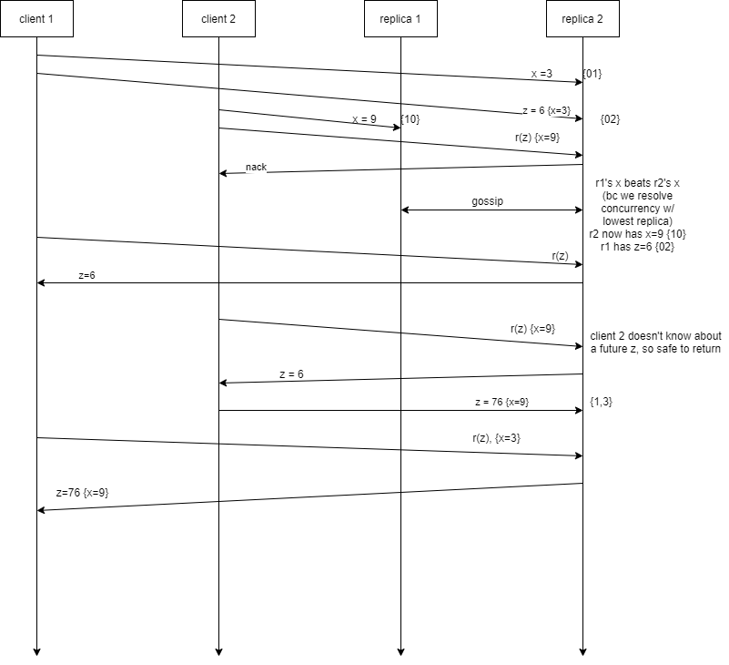
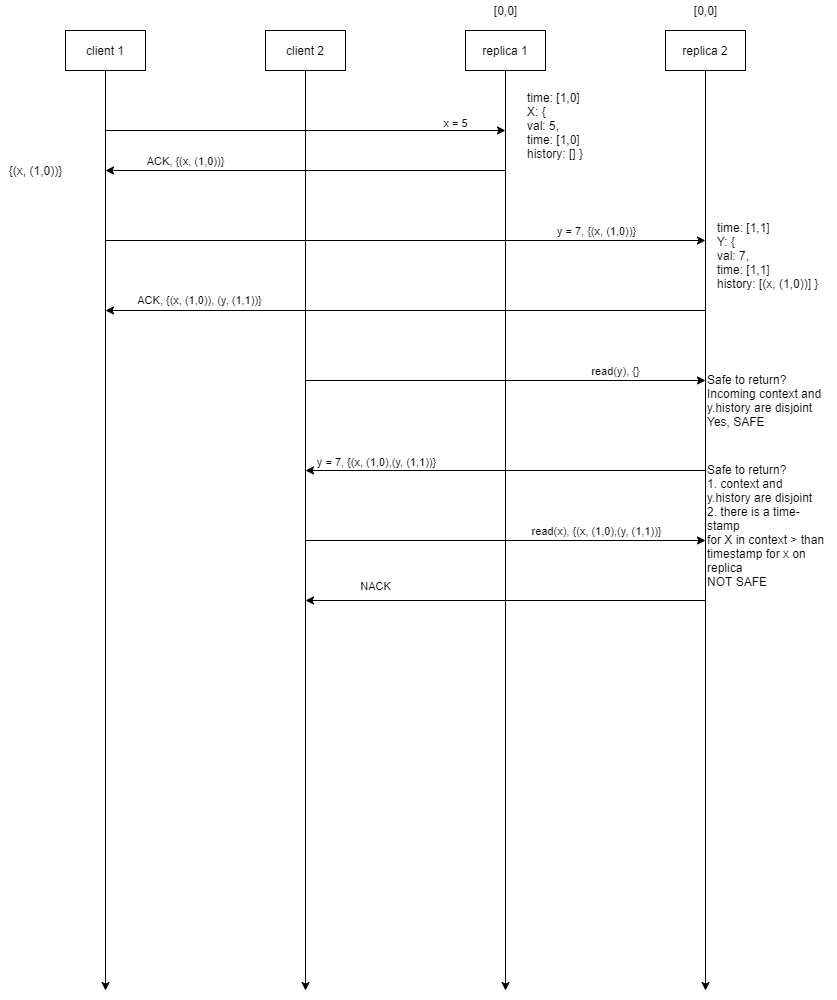

## Requirements
### Features / Functionalities
1. Uniform distribution of keys across all shards  
2. Each key is on only 1 shard, each shard is stored on m nodes, m = replication factor  
3. There are n shards where n * m = total number of nodes in the system  
4. Reshard only when requested - not automatically  
5. If a node is a proxy, it must respond to requests with the address of the correct storage node  
6. Each node is capable of handling client requests  
7. Perform view changes when requested, which may change replication factor  
8. Insert, update, get keys/values  
9. Nodes can respond to key-count requests  
10. Reads on data items will be causally consistent  
11. Eventually, if writes to a data item stop, and there are no network partitions, all replicas 
in a shard will converge to a strongly consistent view of their key/value pairs  
12. System is available - if even one replica is alive, it should respond (if it safe to do so)  
13. Clients must (and are expected to) include proper JSON data with all required information in their requests  
  
### Endpoints
- /kvs/keys/<key>
- /kvs/key-count
- /kvs/shards
- /kvs/shards/<shard-id>
- /kvs/view-change
- /kvs/gossip
- /kvs/liveness
  
### Nodes
- A node is an individual instance of the program, corresponding to a logical shard and one of possibly many replicas
- The number of nodes in the view = shards * replication factor  
  
**Ex for shards = 2, replication factor = 2:**  
```
+-----------------------+   +-----------------------+   +------------+   +------------+
|   node1               |   |   node2               |   |   node3    |   |   node4    |
| --------------------- |   | --------------------- |   | ---------- |   | ---------- |
|  shard1               |   |  shard1               |   |  shard2    |   |  shard2    |
|  replica1             |   |  replica2             |   |  replica1  |   |  replica2  |
| --------------------- |   | --------------------- |   | ---------- |   | ---------- |
|  - key1               |   |  - key1               |   |  - key2    |   |  - key2    |
|  - key3               |   |  - key3               |   |  - key4    |   |  - key4    |
|  - key5               |   |  - key5               |   |  - key6    |   |  - key6    |
|  - attending_class    |   |  - attending_class    |   |  - key8    |   |  - key8    |
+-----------------------+   +-----------------------+   +------------+   +------------+
```
  
### Calculating new key locations
*h(k) % n = ID*  
  
Hashing will be used to calculate new locations for key/value pairs. Each node will iterate over its entire KVS and apply
a hash function *h* to each key *k*. Then the modulus of this value *h(k)* will be applied with respect to the number of shards 
*n* to produce the ID of the destination shard.  
  
### Assigning IDs to nodes
1. Nodes are assigned IDs based on their ip address: Because each node receives a list of all nodes addresses at instantiation 
and during a view change, they can always sort the addresses in ascending order and make the index the ID of the node. They 
also know their own address from the environment variable *ADDRESS* so they will always agree on the ID assignments. IDs
should be checked on every view change because a nodes ID could change -- only guaranteed to remain constant over the duration 
of the current view. Each node has an array of shard arrays. Each shard array has the nodes in that shard.  
- Nodes will have two IDs: shard_ID, node_ID
- node_ID = unique identifier of each node
- shard_id = int(node_ID / repl_factor)
- a node will know the addresses of everyone in his shard because they will be all node_IDs in range
[(local_shard_ID * repl_factor):(local_shard_ID * repl_factor) + repl_factor]  
  
## View Change / Reshard Mechanism
### Making a view change request
View change requests can be sent to any node and contain a JSON payload containing the node addresses and replication factor, of the form:
{"view":"10.10.0.4:13800,10.10.0.5:13800,10.10.0.6:13800", "repl-factor":*int*}.
  
### Performing a view change

```           
    handle view change:
        /* it is guaranteed that all nodes are alive when a 
           view change request is issued, so we can temporarily
           elect a 'shard leader' and it is trivially guaranteed
           that all nodes will agree on who the leaders are
           based on our method of assigning shard and replica IDs
           -- by using a shard leader, the shard leaders can communicate
           and exchange keys on behalf of the entire shard */
        
        0. If the receiving node is not the leader of his shard, he forwards
           the request to his shard leader and acts as a proxy for the response
        1. view change leader tells other shard leaders to collect all
           their keys
           a. shard leaders get keys from all other replicas to assemble the
              full kvs of the shard
        2. view change leader gives the new view to every node in the system
        3. view change leader tells the shard leaders to rehash their keys
        4. view change leader rehashes his own keys and broadcasts them
        5. view change leader tells other shards to broadcast their data
           and waits for all shard leaders to ack him
        6. view change leader tells new shard leaders to distribute their
           keys to all replicas in their shard
        7. view change leader gives his keys to other replicas in his shard
        8. view change leader acks the client
```
 **In the following diagram, the reshard is illustrated with a replication factor of 1 (each shard has only 1 node). But imagine
 The same process working across several replicas by replacing "node" with "shard" and understand that only 'shard leaders' 
 exchange keys**
  
  
  
## Pseudocode
**The following pseudocode is out-dated. This is a reflection of a previous implementation, in which replication was not yet present. 
The process is largely the same, but details are missing.**
```
Class Node:
    def __init__(self):
        # Get nodes addresses, IDs, count of nodes
        self.VIEW = os.environ.get('VIEW')
        self.this_addr = os.environ.get('ADDRESS')
        self.node_IDs = []

        for address in VIEW:
            node_IDs.append(address)

        # sort the addresses in case they are not provided to every node in the same order
        node_IDs.sort()
        self.num_nodes = len(node_IDs)
        self.this_ID = node_IDs.index(this_addr)

        self.local_KVS = {}
        self.foreign_KVS = []   # list of foreign kvs dictionaries (sent by other nodes)
        self.rehash_done = False    # flag for resharding
        self.dict_update_count = 0  # flag for resharding (used by triggering node)
        self.reshard_count = 0          # count of dictionaries received for resharding
        self.master_ID = -1

    def reset_reshard_flags():
        self.rehash_done = False
        self.dict_update_count = 0
        self.reshard_count = 0
        self.foreign_KVS.clear()
        self.master_ID = -1


    # triggered by the client, tells other nodes to begin resharding
    def initiate_reshard(new_view):
        # figure out new IDs, addresses, etc ------------------------
            VIEW = new_view
            node_IDs = []

            for address in VIEW:
                node_IDs.append(address)

            # sort the addresses in case they are not provided to every node in the same order
            num_nodes.sort()
            num_nodes = len(node_IDs)
            this_ID = node_IDs.index(this_addr)
        # -----------------------------------------------------------
                # NOTES: 
        # - We'll want to do the requests asynchronously, see below
        # notify other nodes of view change
        # for addr in VIEW:
        #   if (addr != this_addr):
        #       requests.put("addr/kvs/reshard/initiate_reshard", json = {"view":VIEW, "node_IDs":node_IDs, "num_nodes":num_nodes})
                
        # NOTES:
        # - Assumes that the IPs in VIEW are already strings
        # - ENDPOINT_HERE will be replaced with an endpoint that tells the other nodes to begin the resharding process.
        #   They can't call the same "initiate_reshared" endpoint because then they'll all make the same requests.
        #   Reference prime() & reshared() in Matt's notes
        # - 1) PRIME ALL FOLLOWERS
        rs = [async.put(addr + '/kvs/reshard/ENDPOINT_HERE", json={'view': VIEW, 'node_IDs': node_IDs, 'num_nodes': numNodes}) for addr in VIEW]
        async.map(rs)
               
            # NOTES:
        # - We'll do our own rehashing first. Reference Matt's notes
        # rehash keys
        # rehash()
        
        # NOTES:
        # - 2) RESHARD MYSELF
        # - 3) DO ANOTHER ASYNC REQUEST CALLS TO "FOLLOWERS" TO RESHARD (Using async code referenced above)
        # - 4) ITERATE THROUGH ARRAY RETURNED VIA MAP & COUNT THE NUMBERS 
        # - 5) IF NUMBERS MATCH, RETURN 200


    def rehash():
        # make a list of dictionaries
            shards = []
            for addr in VIEW:
                shards.append(dict())

        # populate the dictionaries
        for key in local_KVS:
            h = hash(key)
            ID = h % num_nodes
            shards[ID].[key] = local_KVS[key]

        # replace 'local_KVS'
        self.local_KVS = shards[this_ID]
        self.reshard_count++

        ## merge dictionaries if node has all of them
        if (reshard_count == num_nodes):
            merge_dict()

        # send shards to other nodes
        for addr in VIEW:
            if (addr != self.this_addr):
                requests.put("addr/kvs/reshard/put_dict", json = shards[node_IDs.index(addr)])


    def do_reshard(request):
        # figure out new IDs, addresses, etc ------------------------
        VIEW = request.json.new_view
        node_IDs = request.json.node_IDs
        num_nodes = request.json.num_nodes
        this_ID = node_IDs.index(this_addr)
        self.master_ID = request.sender_address
        # -----------------------------------------------------------

        rehash()

    def put_dict(request):
        # get dictionary from json
        new_dict = request.getjson()
        self.foreign_KVS.append(new_dict)
        self.reshard_count++

        # merge if node received all dictionaries 
        if (reshard_count == num_nodes):
            merge_dict()


    def merge_dict():
        for dict in foreign_KVS:
            for key in dict:
                local_KVS[key] = dict[key]
        addr = VIEW[master_ID]
        request.put(<addr>/reshard/<finished>)


    def reshard_finished():
        self.dict_update_count++


    def get_key_count():
        return len(local_KVS)

```  
  
## Causal Consistency Mechanics
### Causality / Happens-Before
- There is a total order to all local processses
- If A → B, and B → C, then A → C; if no such order exists between A and C then the events can happen in any order
- A causal context must be included in all reponses to clients
- Nodes gossip to guarantee eventual consistency and will do so **generally within 500ms of an update**
    
#### How do we define causality?
We are not concerned with a total ordering of events and if two events occur one after another on the same replica, we can know that by looking at their vector clocks, 
but it doesn't necessarily matter for consistency.  
  
For example, client 1 writes *x* to replica 1. Then, client 2 writes *y* to replica 1. In some sense, *y* was written 
after *x* (at least replica 1 received the PUT after, but that doesn't mean the second client really wrote it after the first client (ex: message from client 2 could have 
been sent before client 1's message but just took a long time to deliver). Thus, we say the two events are concurrent and x *is not* a dependency of y.  
  
Now, let's say client 2 writes a new value *z* to replica 2. Now *z* *is dependent* on *y* because client 2 was aware of *y* and *z* was meaningfully written after *y*.  
  
Thus, our definition of causality is defined entirely around what events a client witnesses.
  

  
#### Casuality basics:
1. A vector clock V = {(r1, t1),(r2,t2),(r3,t3),...}
    - Let's define our vector clocks:
    - Only 'put' operations count as events
    - Merging, comparing, adding new events like in class: monotonically increasing, ordering over ints, piece-wise max merge
2. Each data item on a replica has:
    - The current value associated with the key
    - Vector clock timestamp of most recent update / 'put' operation
    - A causal history H = {h1, h2, h3,...} where each h(i) = (k, v)
        - k = a key of a data item
        - v = the timestamp of an update associated with that key; timestamp is a vector of the form described in (1)
3. Client Context:
    - VectorClock high_time ==> replicas can use clients to piggback the current time and update accordingly
    - History context
  
**Example of replicas piggbacking current_time on clients:**
  
  
   
#### Causality and consistency (updated and more specific) ==> see classes below for implementation details:
1. Each replica stores the current time as a VectorClock, this is the most basic unit we need so that we know when events are occuring
2. Each replica has a dictionary with all of its key:value pairs (exactly the same as asgn2)
3. Each replica has another dictionary with the causal histories of all the keys:
   - Indexing by key
   - The value associated with the key is a History object
   - includes most recent timestamp of the key itself
   - Dictionary ==> makes it very easy to access elements, make comparisons, updates, etc
4. Each replica has a dictionary 'between-gossip-hist', which stores the history of events since the last gossip
   - don't necessarily need to store this -> could just store list of updated keys and then grab the histories
     from the dictionary in (3)
   - Makes it easy and more efficient to compare and merge histories during gossip
   - Can be deleted after gossip if **all replicas** received it
   - Indexed by key
   - Value associated with key is a History object
5. When keys are PUT:
   - the replicas vectorClock must be updated
   - the key must be assigned a causal history equal to the replica's history
   - the event must be added to the between-gossip-history
   - context updated and returned to client 
6. The causal context returned to the client is dictionary of Key:History pairs
   - causal context returned is the incoming client context + new PUT event
7. When keys are read:
   - NACK if client_History has a more recent x than the replica has
   - otherwise, client_History.merge(x History)
   - return client_History
  
**Concurrency example**

  
   
#### Comparing Vector Clocks
Let a VectorClock V = {(r1,t1),(v2,t2)...}  
Let A and B be two Vector Clocks
1. A < B if every t(i) in A is less than or equal to every t(i) in B
2. A > B if every t(i) in A is greater than or equal to every t(i) in B
3. A & B are concurrent if neither (1) nor (2) are satisifed
    - Example: Some t(i) in A are greater than B and some t(i) in A are less than B
  
#### Returning values to clients:
Values can be returned to a client if the timestamp associated with a key is >= the timestamp associated with that item in the client context.  
Clients are not permitted to read concurrent writes!
  
#### Putting values:
It is always safe for clients to PUT values
  
#### Client Context objects
{"high_clock":VectorClock,"history":History, "current_view":*int*}
1. GET/PUTs must check value of current_view
    - if current_view < self.current_view:
        - clear the client's context and set there new current_view value equal to ours
        - GET/PUT is safe because the client's history is dependent on a previous view

#### Visual Intuition / Example run:
  
  
  
#### High Level overview
```
class VectorClock {
    __init__(self, [address1, address2,...]):
        /* 
          initialization requires addresses of replicas (passed in as list)
        */
        self.clock = {"address":time,...}   # one entry for every replica (in local shard)
        
    compare(VectorClock v1, VectorClock v2):
        /* Return 1 if v1 > v2
           Return 0 if v1 & v2 are concurrent
           Return -1 if v1 < v2 */
        
    merge(self, VectorClock):
        /* Do piece-wise-max merge of the vectors,
           update self.clock to that */
           
    increment(self, address):
        /* increment the time associated with repl_ID */
        if address not in time_vector:
            reject update
        self.clock[address] += 1
        
}
```

```
class History {
    /* 
        A history is a collection of events, stored as a dictionary and represented as:
            {"key1":VectorClock, "key2":VectorClock,...}
        
        Purpose:
                 This class will be used to hold the casual history of each data item:
                      Track per-item history
                      
                 Furthermore, it will be used to hold a temporary between-gossip history:
                      When new events occur on a replica, they are added to 
                      the between-gossip history. This
                      way, we can just send the between-gossip history during gossip and
                      use merge() to merge incoming between-gossip-histories with ours.
                      Then, delete between-gossip history (only if all replicas received
                      them though)
    */
    
    __init__(self):
        self.hist = {(key, vector_clock),...}
        
    insert(self, key, VectorClock):
        /* insert a new key and its VectorClock timestamp 
           if the key already exists -> override it with the new value
        */
        
    merge(self, foreign_hist):
        /* 
        Desc: merge the incoming causal history with our local one
        
        Parameter: a History object
        
        What it Does:
            For every event in foreign_hist, update the corresponding key 
            in self.hist if the key in foreign_hist has a more recent timestamp.
            HINT: you can call VectorClock.compare() to figure this out.
            
        Return Value:
            Return a list of all keys that were replaced
                # This is important bc it will tell us which keys in kvs must be updated as well
        */
}
```

```
class Replica {
    /*
        This class isn't really new, but an extension of the node class (new things we need)
    */
    __init__(self, nodes[], repl_factor):

        self.view = [addr1,addr2...]  # list of all nodes in system -- sorted

        self.shards[i][j] = addr of replica j in shard i

        self.this_shard = id of the shard this node is in (an integer)

        self.local_kvs = {}         # the kvs dict of this node

        self.per_item_history = {key:History,key2:History....}  # {key : History} -- History contains all
                                                                # dependencies of 'key' (including most 
                                                                # recent timestamp of 'key')

        self.between_gossip_updates = History()   # keys and their most recent updates (since last gossip)

        self.cur_time = VectorClock               # time of last event of this replica

        self.replica_alive = []   # boolean values corresponding to whether a replica is alive
                                  # a self.shard[i] will always have replica shards in sorted
                                  # order, so you can use those indexes to also index this list

}
```
  
```
    handle PUT requests for item x on replica r:
        1. update r.cur_time with merge of r.cur_time and highest timestamp in client_context
        2. update(x), set time(x) to cur_time, update x's dependencies with client_context
        3. return SUCCESS, client_history.insert(x, time(x))
        
        
    handle GET requests for item x on replica r:
        1. update r.cur_time with merge of r.cur_time and highest timestamp in client_context
        2. if there is no timestamp(x) in client_context > r.timestamp(x):
              a. return x, client_history.merge(history(x))
        3. else: return NACK
        
        
    handle GET key-count for a node:
        1. return len(kvs), shard-id ==> how do we do this though? --> replicas may not be consistent yet / have diff # keys
        
        
    handle GET ID for a shard:
        /* what is a shard ID in the spec? essentially just asking shard count? */
        
        
    handle GET info for a specific shard:
        /* how to return an accurate key count if 
           one replica has more items than another?
           Should we make them consistent first?   */
           
```  
   
### Gossip:
 **Summary**
1. Compile a list of keys that were updated since last gossip + their values (items_to_update)
2. Init dictionaries to store responses from gossip + throw our own data in there to compare later
   ```
   history_responses = { 
       address: {
           key : timestamp of last update (vc),
           ...
       },
       ...
    }

   items_responses = { 
       address: {
           key : value from last update,
           ...
       },
       ...
    }

   vc_responses = { 
       address: vector clock
       ...
    }
   ```
3. For every address in my shard except mine, send a gossip message
   - contains items_to_update, my per-item history, & my vector clock
4. If i get no response, mark the replica as dead
5. Else, add their response (contains *their* items, history, & vector clock) to the dicts we init'd earlier (2)
6. Take history_responses and items_responses and find the most current values and their timestamps
7. Use ther return from (6) to update our own kvs and per-item-history
8. Update our'general' vector clock by looping through  vc_responses
9. IF WE DARE...
   -   we can clear out current_events []
   -   this was a global list of all the keys that have been modified since last gossip
       -   we track this so we dont send our **entire** kvs during gossip, only relevant items

